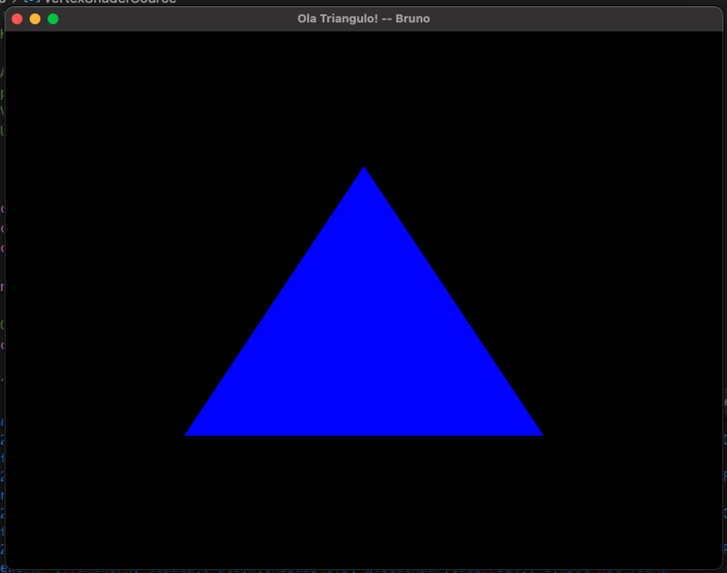

# Resultado Execução HelloTriangle



## Observações:
- Tive alguns erros ao executar em um ambiente MACOS, mas segui o tutorial desse vídeo aqui, e foi possível executar: https://www.youtube.com/watch?v=7-dL6a5_B3I

- Outro ponto, ao setar as `GLFW_CONTEXT_VERSION_MAJOR`, `GLFW_CONTEXT_VERSION_MINOR` e `GLFW_OPENGL_PROFILE` precisei usar outros valores, então usei o código abaixo:

```cpp
	glfwWindowHint(GLFW_CONTEXT_VERSION_MAJOR, 3);
	glfwWindowHint(GLFW_CONTEXT_VERSION_MINOR, 3);
	glfwWindowHint(GLFW_OPENGL_PROFILE, GLFW_OPENGL_CORE_PROFILE);
```