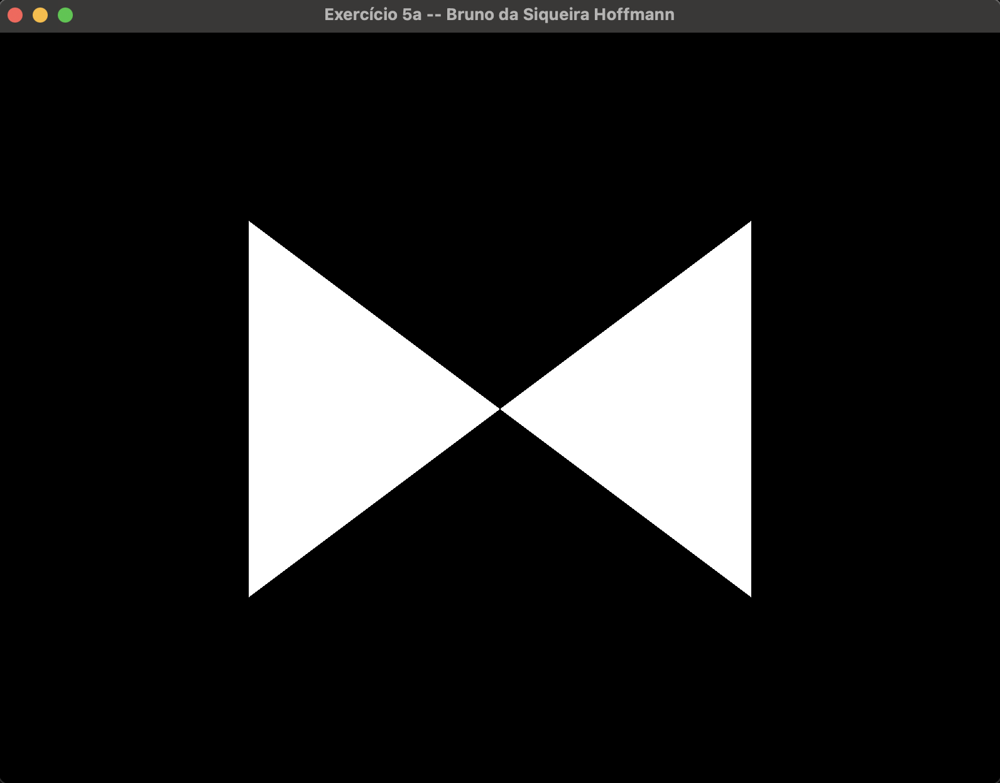
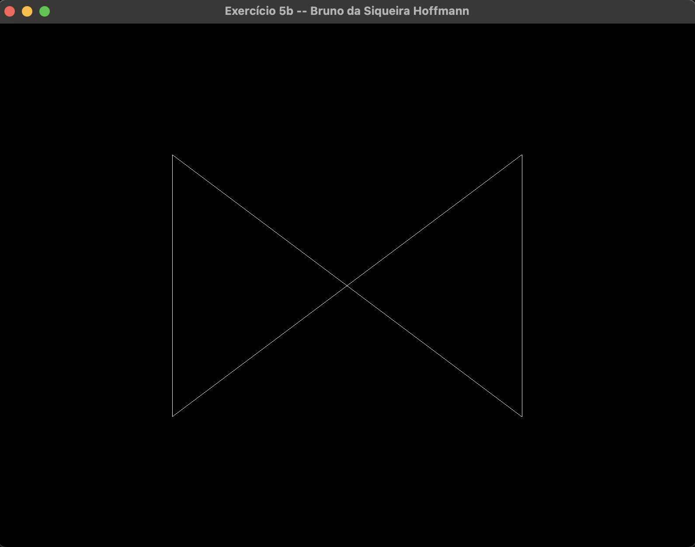
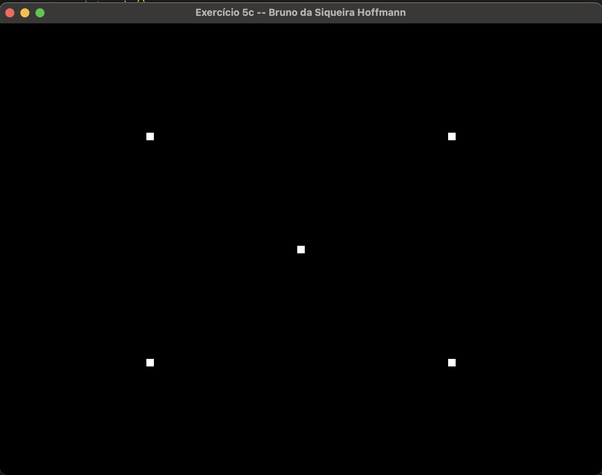
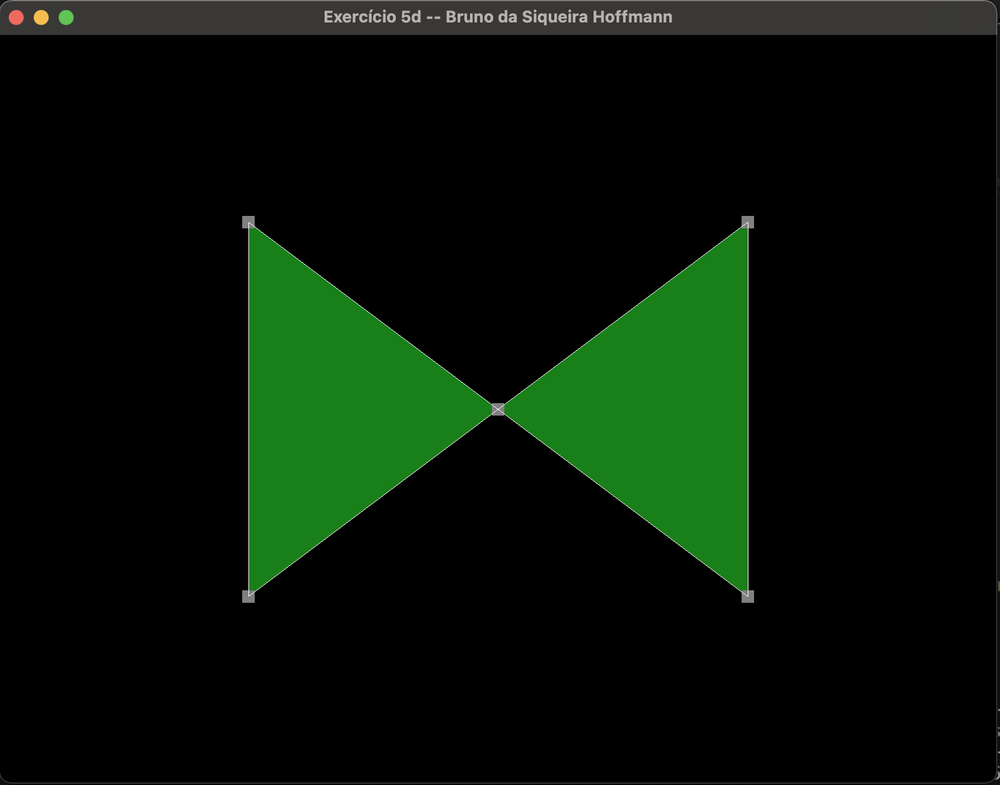

# Lista de Exercícios 1 – Processamento Gráfico

Nome: Bruno da Siqueira Hoffmann

Professora: Rossana Baptista Queiroz

## Questão 1

**Questão:** O que é a GLSL? Quais os dois tipos de shaders são obrigatórios no pipeline programável da versão atual que trabalhamos em aula e o que eles processam? 

**Resposta:** A GLSL é uma linguagem de programação para escrever shaders, de modo que ela é semelhante ao `C-Style`, possibilitando uso de diferentes estruturas de controle. Além disso, os programas escritos em GLSL serão executados diretamente na GPU, a medida que otimiza o processo e tira a carga da CPU para fazer o processamento do mesmo.

Com relação aos tipos de Shaders que são obrigatórios no pipeline programável e que trabalhamos em aula, temos o Vertex shading e o Fragment shading. O Vertex shading será responsável por manipular as coordenadas em um espaço 3D, identificando onde cada elemento está no espaço. Como entrada esse processo de shading recebe as informações dos vértices, e como saída os dados processados, contendo a posição do vértice. Ele vai ser responsável por dar um valor a variável `gl_Position`.

O outro shader obrigatório visto em aula foi o Fragment shading, sendo ele responsável por definir as cores de cada um dos fragmentos. Sua entrada consiste nos dados passados de outros shaders (podendo ou não ser o Vertex Shader), e sua saída consiste na cor final do fragmento. Ele vai ser responsável por dar um valor a variável `gl_FragColor`.

Referência: 
- https://www.khronos.org/opengl/wiki/Core_Language_(GLSL)

- https://developer.mozilla.org/en-US/docs/Games/Techniques/3D_on_the_web/GLSL_Shaders

## Questão 2

**Pergunta:** O que são primitivas gráficas? Como fazemos o armazenamento dos vértices na OpenGL?

**Resposta:** Primitivas gráficas são unidades de básica de construção da nossa imagem, elas podem ser vértices, linhas, retas, triângulos, curvas e etc. E podemos fazer o armazenamento dos vértices em memória através do uso dos Buffers de geometria, sendo eles o VAO e VBO.

## Questão 3

**Pergunta:** Explique o que é VBO, VAO e EBO, e como se relacionam (se achar mais fácil, pode fazer um gráfico representando a relação entre eles).

**Resposta:**  O VBO (Vertex Buffer Object) é responsável por armazenar as informações em relações aos vértices na GPU, sendo essas informações: as coordenadas, as cores e algumas outras informações.

O VAO (Vertex Array Object) é responsável por guardar as informações de o que cada posição do array significa, como o caso de, da posição 0 a 2 será as coordenadas, da posição 3 a 5 as cores e assim por diante. Ou seja, ele permite a gente identificar os atributos do vértice.

E o EBO (Element Buffer Objects) é responsável por armazenar as informações relacioandas aos índices que armazenam a ordem de renderização dos vértices, de modo que será possível fazer o reaproveitamento desses vértices.

A relação dos três é dada da seguinte forma: o VBO terá as informações de fato, como o caso de números de [-1, 1] que indicam as coordendas, números de [0, 1] que indicam as cores, e etc. A partir dessas informações do meu VBO, o VAO vai identificar o que cada posição desse array gerado pelo VBO representa, ou seja, os atributos que representam essas informações. Por fim, o EBO vai indicar a ordem desses vértices para que a primitiva seja desenhada, dessa forma, você não precisa repetir os vértices no VBO, para formar o desenho desejado.

## Questão 4

**Pergunta:** Analise o código fonte do projeto Hello Triangle. Localize e relacione os conceitos de shaders, VBOs e VAO apresentados até então. **Não precisa entregar nada neste exercício.**

## Questão 5

**Pergunta: ** Faça o desenho de 2 triângulos na tela. Desenhe eles:
- a. Apenas com o polígono preenchido;
- b. Apenas com contorno;
- c. Apenas como pontos;
- d. Com as 3 formas de desenho juntas

**Resposta:**

O código referente a questão A localiza-se no caminho [Questão A](./exercicio5a.cpp). E o desenho gerado após a execução foi esse:

O código referente a questão B localiza-se no caminho [Questão B](./exercicio5b.cpp). E o desenho gerado após a execução foi esse:

O código referente a questão C localiza-se no caminho [Questão C](./exercicio5c.cpp). E o desenho gerado após a execução foi esse:

O código referente a questão D localiza-se no caminho [Questão D](./exercicio5d.cpp). E o desenho gerado após a execução foi esse:

