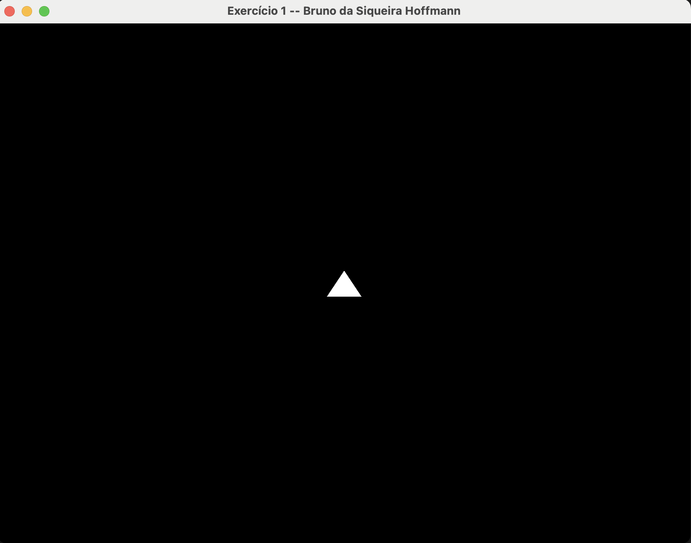
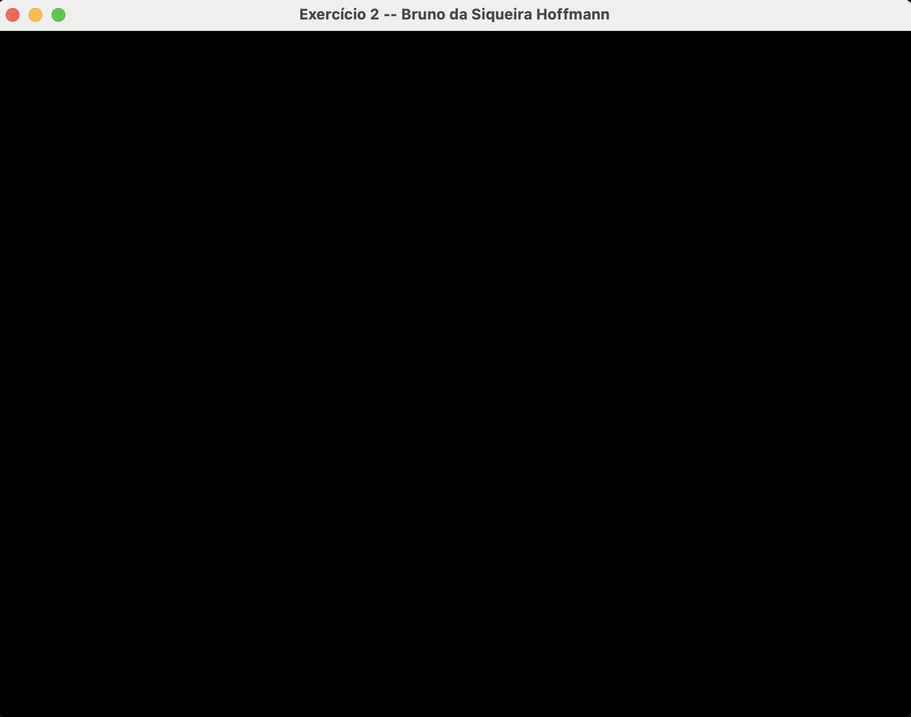
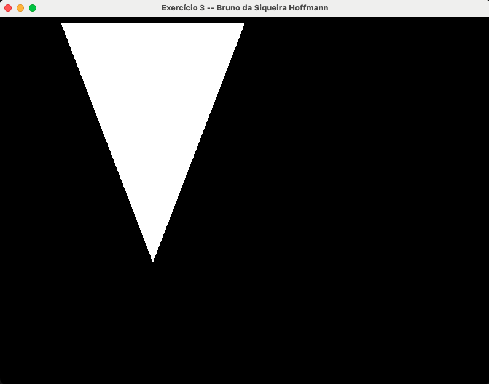
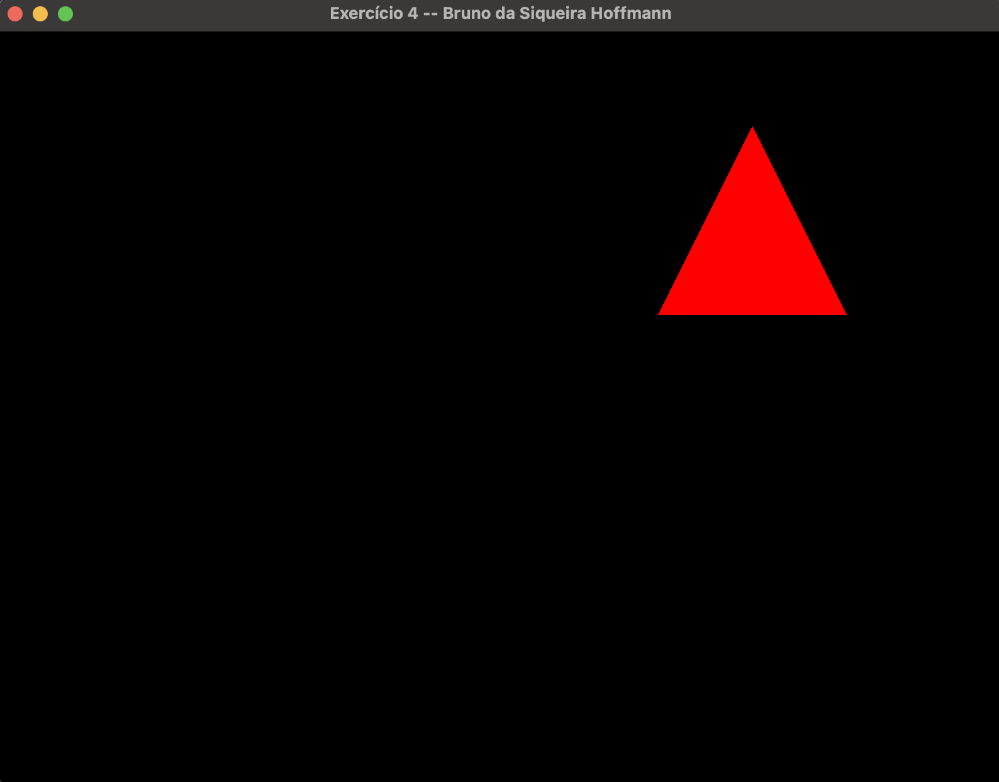
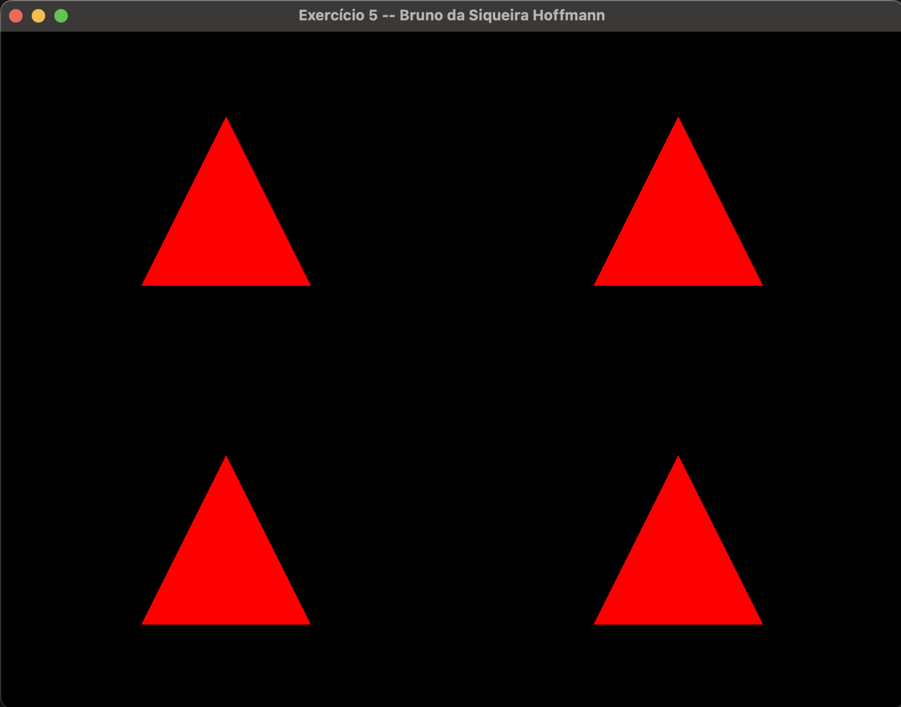

# Lista de Exercícios 2 – Processamento Gráfico

Nome: Bruno da Siqueira Hoffmann

Professora: Rossana Baptista Queiroz

## Questão 1

**Questão:** Modifique a janela do mundo (window/ortho) para os limites: xmin=-10, xmax=10,
ymin=-10, ymax=10.

**Resposta:** Após a mudança da janela do mundo para os limites, foi possível verificar a imagem abaixo. O código da mudança está no arquivo [exercicio1.cpp](./exercicio1.cpp).

## Questão 2

**Questão 2:** Agora modifique para: xmin=0, xmax=800, ymin=600, ymax=0.

**Resposta:** Após a mudança para os valores solicitados, foi possível verificar que a janela do mundo ficou fora da região que localiza-se o triângulo. O código com a configuração está no arquivo [./exercicio2.cpp](./exercicio2.cpp).

## Questão 3

**Questão:** Utilizando a câmera 2D do exercício anterior, desenhe algo na tela. O que acontece
quando posicionamos os objetos? Por que é útil essa configuração?

**Resposta:** O posicionamento dos objetos da tela é útil para o caso em que queremos ter a visão do objeto em relação a câmera 2D, dessa forma, se mudarmos o posicionamento da câmera veremos o objeto de uma perspectiva diferente, podendo ser uma sensação de que o objeto está mais próximo ou mais distante da câmera. Outro ponto observado é que os valores indicados no posicionamento, será capaz de definir os limites de x e y, de modo que, possibilita que utilizamos outros valores de coordenadas além do intervalo [-1,1]. No arquivo [./exercicio3.cpp](./exercicio3.cpp) foi feito o desenvolvimento de um objeto que está dentro da visão da câmera.

## Questão 4

**Questão:** Modifique o viewport para desenhar a cena apenas no seguinte quadrante da janela
da aplicação.

**Resposta:** Foi feita a modificação da viewport, conjunto com a alteração da escala e a transladação do triângulo. A partir disso, chegou-se a figura a abaixo. O código que realiza as mudanças se localiza [./exercicio4.cpp](./exercicio4.cpp).

## Questão 5

**Questão:** Agora, desenhe a mesma cena nos 4 quadrantes.

**Resposta:** Foi feita a modificação da viewport, conjunto com a alteração da escala e a transladação do triângulo. A partir disso, chegou-se a figura a abaixo. O código que realiza as mudanças se localiza [./exercicio5.cpp](./exercicio5.cpp).

